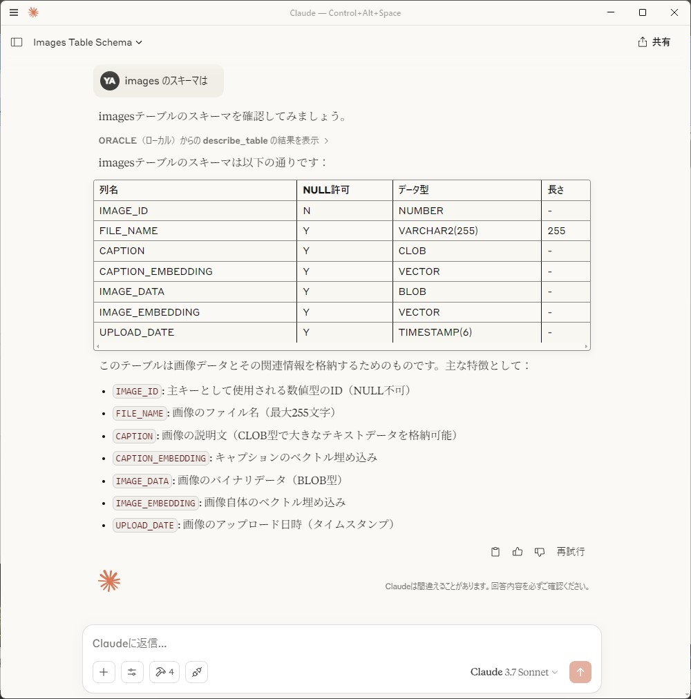
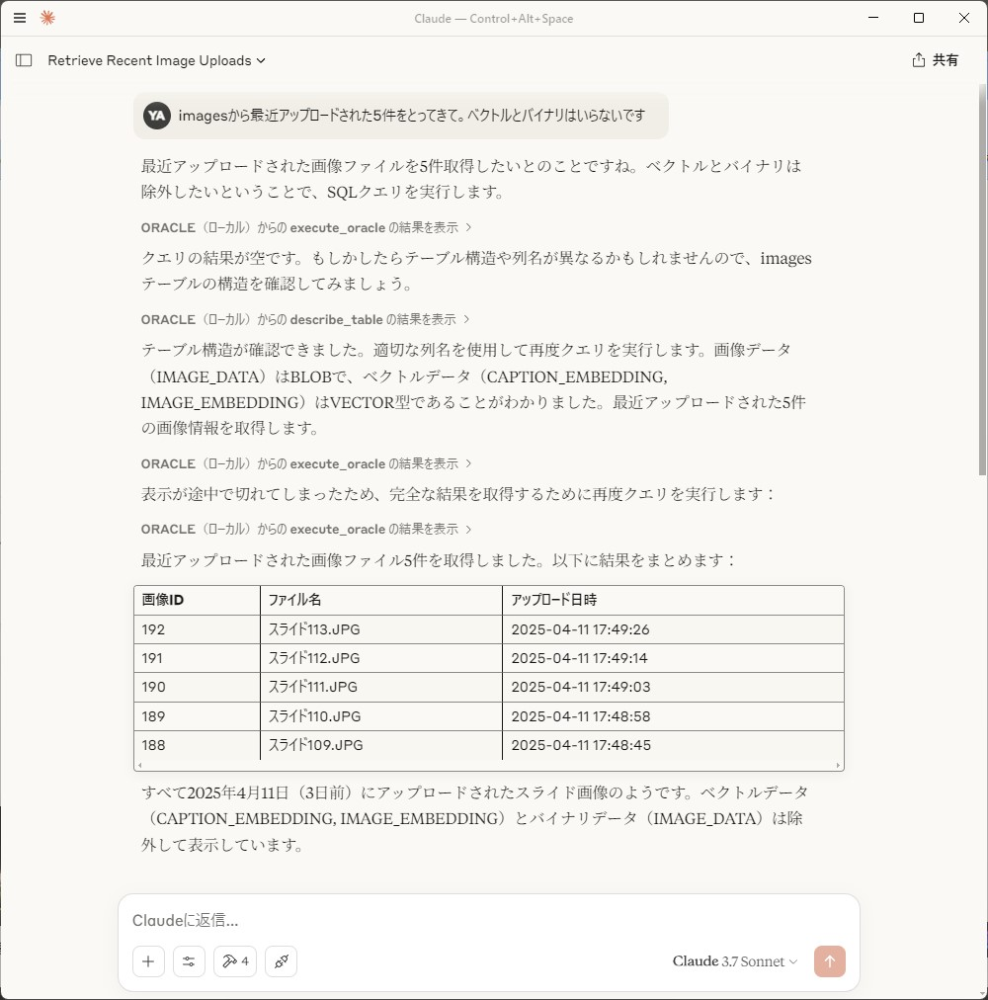
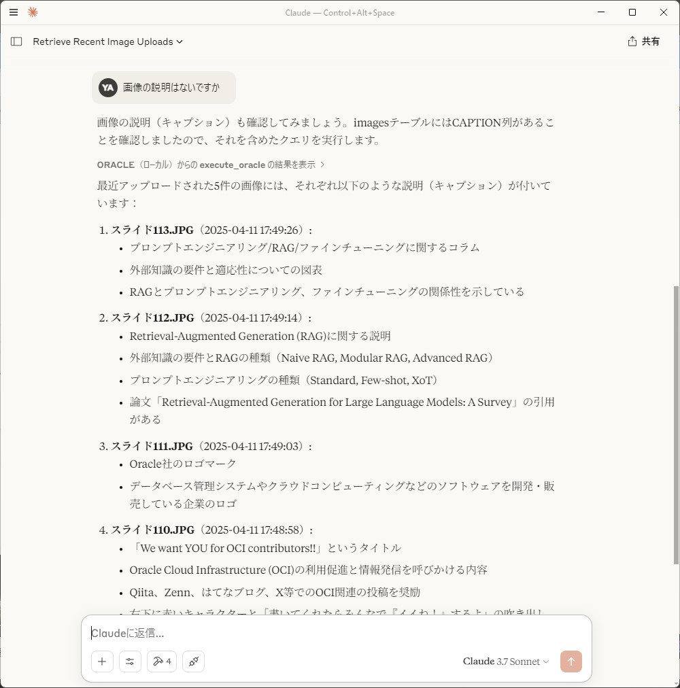
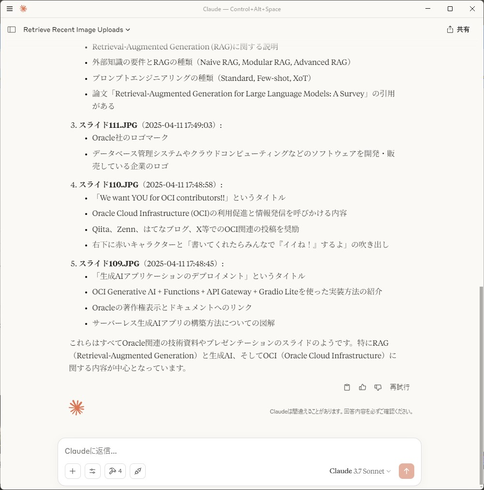

# MCP Server for Oracle Database（極めて実験的）

Oracle Database用のMCP（Model Context Protocol）サーバーの実験的な実装です。このサーバーは、AIアプリケーションがOracle Databaseに対してSQLクエリを実行し、その結果を取得するためのものです。MCPサーバーはローカルで実行されます。Cursor や Cline などの MCP クライアントから呼び出してシームレスなデータベース体験を提供することを目指してます。

## 機能

- Oracle DatabaseへのSQLクエリ実行
- テーブル構造の取得
- セキュリティ対策（クエリ長制限、危険なキーワードチェック）
    - 最小限のセキュリティ対策のみ施されています。外部からアクセスできないローカルな環境でのみ使用してください。
- 結果のフォーマット機能（LLMに呼んでもらうものなので、余計なことをしているかも）

## 必要条件

- Python 3.11以上
- Oracle  Databaseへのアクセス権限
- 必要な環境変数の設定（.envファイル）
- uv（高速なPythonパッケージマネージャー）

※テストは、Windows 11 のみで行っています。Linux/Mac の場合は、ディレクトリパスの表記などは適宜読み替えてください。

## セットアップ

1. リポジトリをクローン:
```bash
git clone [repository-url]
cd mcp-server-for-oracle-database
```

2. 仮想環境を作成して有効化:
```bash
uv venv .venv
```
```bash:Python仮想環境の有効化（Linux/Mac/Windows の gitbash など）
source .venv/bin/activate
```
```PowerShell:Python仮想環境の有効化（Windows PowerShell）
.venv\Scripts\activate
```

3. 依存パッケージをインストール:
```bash
uv pip install -r requirements.txt
```

4. 環境変数の設定:
`.env`ファイルを作成し、以下の情報を設定:
```
ORACLE_USER=your_username
ORACLE_PASSWORD=your_password
ORACLE_DSN=your_dsn
```

## 提供されるツール

### execute_oracle
SQLクエリ（SELECT文のみ）を実行し、結果をフォーマットして返します。
- パラメータ:
  - query: SQLクエリ（SELECT文のみ）
  - params: バインド変数
  - max_length: 応答の最大文字数
  - max_rows: 取得する最大行数

  ※LLMがパラメータの使い方を試行錯誤することが多いようです。クライアントへパラメータの使い方を上手く伝える方法があったら教えてください。
  ※読むのは LLM なのでフォーマットは余計かもしれません。

### describe_table
テーブルの構造を表示します。sqlplus の describe を模しています。
- パラメータ:
  - table_name: テーブル名

## 使用方法

### MCPクライアントへの登録:
Claude Desktop や Cursor の MCP 設定ファイルに以下を追加します。
```json
{
  "mcpServers": {
    "ORACLE": {
      "command": "仮想環境の Python 実行ファイルへの絶対パス（...\\mcp-server-for-autonomous-database\\.venv\\Scripts\\python.exe）",
      "args": [
        "MCPサーバーの絶対パス（....\\mcp-server-for-oracle-database\\oracledb_mcp_server.py）"
      ]
    }
  }
}
```
※構成ファイルを変更した後は、MCPクライアントの再起動が必要です。Claude Desktop の場合、バックグラウンドで動いているプロセスも一度停止してから再起動してください。
### Claude Desktop や Cursor 等の MCP クライアントでいろいろお試しください。
#### 例1: テーブルの構造を表示
```text
xxxx テーブルの構造をしらべて
```
```text
xxxx のスキーマは
```


#### 例2: テーブルのデータを取得
```text
xxxx テーブルのデータを取得して
```



#### 例3: SQL の実行
```text
この SQL を試してみて
```


## セキュリティ

- SELECT 文以外は受け付けません
- クエリ長の制限（デフォルト: 1MB）
- 危険なキーワードのチェック
- 入力値のサニタイズ
- 読み取り専用クエリの検証